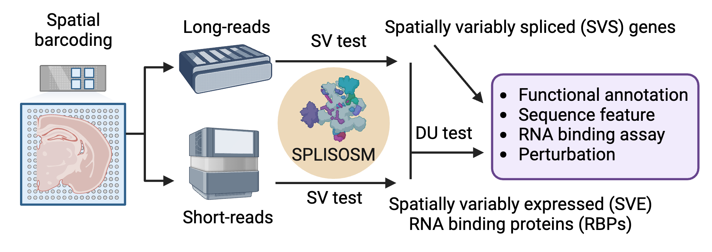
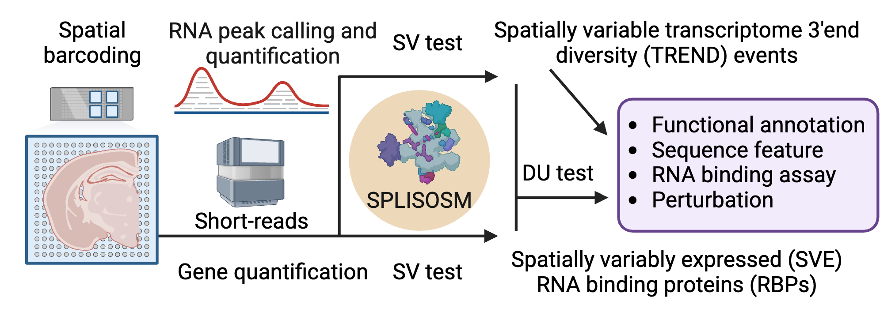

# Scripts for "A computational framework for mapping isoform landscape and regulatory mechanisms from spatial transcriptomics data"

## Description

This repository contains the scripts to reproduce results and figures for the SPLISOSM paper:

Su, Jiayu, et al. "A computational framework for mapping isoform landscape and regulatory mechanisms from spatial transcriptomics data." bioRxiv (2025): 2025-05.

## Table of Contents
- [Instructions](#instructions)
- [License](#license)

## Instructions

### Running SPLISOSM for isoform pattern discovery
[SPLISOSM](https://github.com/JiayuSuPKU/SPLISOSM) is a Python package for isoform pattern discovery from spatial transcriptomics data. Note scripts in this repository were run using an archived dev version of SPLISOSM (temporarily named as "isosde").

Long-read workflow |  Short-read workflow
:-------------------------:|:-------------------------:
  |  

The common SPLISOSM analysis workflow is as follows:
1. **Quantify isoform expression**: Any isoform quantification tool (e.g., [IsoQuant](https://github.com/ablab/IsoQuant) for full-length isoform or [Sierra](https://github.com/VCCRI/Sierra/tree/master) for transcript 3'end diversity). In our analysis, for long-read data, we download directly the processed isoform quantification results from the original studies; for short-read data, we use [Sierra](https://github.com/VCCRI/Sierra/tree/master) for TREND quantification.
2. **Run SPLISOSM's spatial variability tests**: Use the `test_spatial_variability` function from the `SplisosmNP` class in [SPLISOSM](https://github.com/JiayuSuPKU/SPLISOSM). 
3. **Run SPLISOSM's differential usage tests**: Use the `test_differential_usage` function from the `SplisosmNP` and `SplisosmGLMM` classes in [SPLISOSM](https://github.com/JiayuSuPKU/SPLISOSM). 
4. **Downstream analysis**:
   - **RNA binding protein (RBP) annotation**: The list of human and mouse RBPs is downloaded from [EuRBPDB](http://eurbpdb.gzsys.org.cn/). RBP binding motifs are downloaded from [CisBP-RNA](http://cisbp-rna.ccbr.utoronto.ca/). RBP CLIP data is downloaded from [POSTAR3](http://111.198.139.65/RBP.html).
   - **Sequence feature analysis**: Use [Suppa](https://github.com/comprna/SUPPA) to parse isoforms into local alternative splicing events. Use [MEME suite](https://meme-suite.org/meme/) to identify sequence motifs. Use [Matt](https://gitlab.com/aghr/matt) for exon feature analysis.
   - **Visualization**: Use [Scanpy](https://scanpy.readthedocs.io/en/stable/index.html) for all data exploration and visualization. Final paper figures are generated using [ggplot2](https://ggplot2.tidyverse.org/) and [plotgardener](https://github.com/PhanstielLab/plotgardener) (for isoform structure visualization) in R.

### Data and intermediate results (to be uploaded)
The `data/` folder contains the raw data used in this study. See [data/README.md](data/README.md) for details on the source of each dataset and links to download the data. 
The `results/` folder contains the results generated by the scripts. See [results/README.md](results/README.md) for details on the structure of the `results/` folder and where to download all intermediate results for reproducing the figures in the paper. Note that some intermediate results and figures in the notebooks may not be exactly the same as those in the paper due to the randomness in some analysis steps, but should be very close.

### Scripts
The `scripts/` folder contains all scripts used to generate the results and figures in the paper.
Here is a breakdown of all scripts in this repository by figure and analysis:

### Figures
1. Fig 1: A computational toolbox for spatial isoform pattern discovery. Cartoon illustration generated using [BioRender](https://app.biorender.com/user/signin).
2. Fig 2 and Fig S1: SPLISOSM produces well-calibrated and permutation-free p-values in simulation. See [scripts/benchmark/](scripts/benchmark).
3. Fig 3 and Fig S2: Integrative analysis reveals spatial alternative splicing programs in adult mouse brain enriched for synaptic and membrane trafficking functions. See [scripts/sit_data_analysis](scripts/sit_data_analysis).
4. Fig 4 and Fig S3: Spatial 3'end transcript diversity in adult mouse brain extends beyond alternative polyadenylation and shows functional convergence on signaling pathways. See [scripts/visium_mouse_cbs/](scripts/visium_mouse_cbs/).
5. Fig 5 and Fig S4: RBFOX regulates neural transcript usage with other splicing factors cooperatively. See [scripts/single_cell_exon/](scripts/single_cell_exon).
6. Fig 6 and Fig S5: Evolutionarily conserved transcript diversity in synaptic genes across the human prefrontal cortex. See [scripts/dlpfc_visium/](scripts/dlpfc_visium/).
7. Fig 7 and Fig S6-7: Spatial transcriptomic diversity in human glioma is shaped by microenvironment composition and immune infiltration. See [scripts/gbm_ont/](scripts/gbm_ont/) for analysis on the ONT cohort and [scripts/gbm_visium/](scripts/gbm_visium/) for the short-read Visium cohort. Visualization scripts are concentrated in [scripts/gbm_ont/visualization/](scripts/gbm_ont/visualization/).

## License

This project is licensed under the [MIT License](LICENSE).